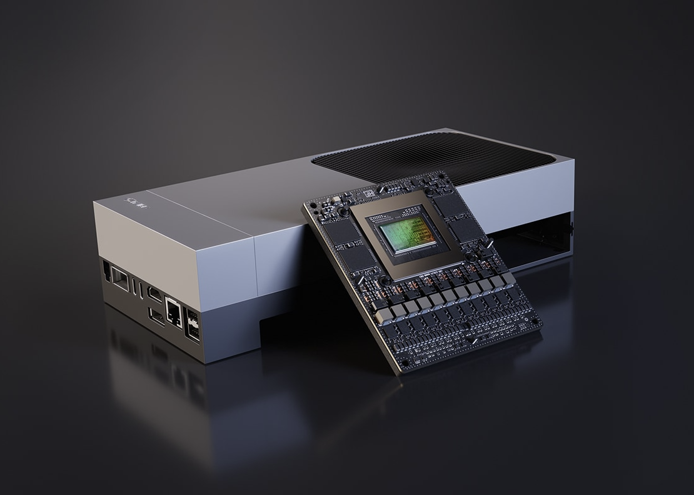

# THOR — Jetson Control Center for macOS

<p align="center">
  
</p>

<p align="center">
  <strong>The first open-source macOS app to manage NVIDIA Jetson devices.</strong>
  <br/>
  <em>Power modes, Docker, ROS2, cameras, GPIO, AI models, ANIMA pipelines — all from your Mac.</em>
</p>

<p align="center">
  <a href="https://github.com/RobotFlow-Labs/thorapp/actions"></a>
  
  
  
  
  
</p>

---

## Install

### Homebrew (recommended)

```bash
brew tap RobotFlow-Labs/tap
brew install thorapp
```

This installs both the **THOR.app** GUI and the **thorctl** CLI.
If you already installed through Homebrew, see the Update section below.

### From Source

```bash
git clone https://github.com/RobotFlow-Labs/thorapp.git
cd thorapp
make build        # Build all targets
make test-unit    # Fast local validation without Docker Desktop
make install-cli  # Install thorctl to /usr/local/bin
make run          # Package .app bundle and launch
```

### Update

If you installed through Homebrew:

```bash
brew update
brew upgrade thorapp
```

If you are tracking the source tree directly:

```bash
git pull --rebase
make test-unit
make run
```

### Requirements

- macOS 14+ (Sonoma) on Apple Silicon
- Swift 6.2+ (`xcode-select --install`)
- Docker Desktop (required for `make test`, optional for real hardware)

`make test-unit` is the fast non-Docker validation path. `make test` is the full simulator-backed suite and needs Docker Desktop running.

### Real AGX Thor First Boot

THOR now vendors the headless Jetson AGX Thor bring-up flow instead of leaving it in private local notes:

```bash
thorctl quickstart nvidia
Scripts/jetson-thor/thor_serial.sh uefi
Scripts/jetson-thor/bootstrap_ssh.sh nvidia@192.168.55.1 ~/.ssh/id_ed25519.pub
```

Replace `nvidia` with the actual username you created during OEM-config.

- Repo runbook: [docs/setup/jetson-agx-thor-headless-quickstart.md](docs/setup/jetson-agx-thor-headless-quickstart.md)
- NVIDIA reference: [Jetson AGX Thor Quick Start](https://docs.nvidia.com/jetson/agx-thor-devkit/user-guide/latest/quick_start.html)

### Repository Guide

- [docs/README.md](docs/README.md) indexes setup, product, and release documentation.
- [CONTRIBUTING.md](CONTRIBUTING.md) explains the local test and PR checklist.
- [Scripts/README.md](Scripts/README.md) explains the canonical script layout.
- `make dist` produces release-ready app and CLI artifacts in `dist/`.
- [SECURITY.md](SECURITY.md) documents supported versions and private vulnerability reporting.

---

## What THOR Does

THOR replaces SSH + terminal workflows with a native macOS control center for your Jetson devices.

### Connect

```bash
# Add your Jetson (GUI or CLI)
thorctl connect 192.168.1.100
# Or use the built-in Docker simulators
docker compose up -d
thorctl connect localhost 8470
```

### Control

The app provides 12 feature panels organized into 4 groups:

| DEVICE | RUNTIME | OPERATIONS | OBSERVE |
|--------|---------|------------|---------|
| Overview | Docker | Files | Logs |
| System Info | ROS2 | Deploy | History |
| Power & Thermal | ANIMA | GPU & Models | |
| Hardware | | | |

### Manage from Terminal

```bash
thorctl health              # Agent health check
thorctl sysinfo             # System info (model, kernel, JetPack, uptime)
thorctl power               # Power mode, clocks, fan speed
thorctl cameras             # List cameras (CSI, USB, ZED)
thorctl gpu                 # GPU info, CUDA, TensorRT, models
thorctl docker              # List Docker containers
thorctl ros2-nodes          # List ROS2 nodes
thorctl ros2-topics         # List ROS2 topics
thorctl ros2-echo /chatter  # Echo a live ROS2 topic
thorctl modules             # List ANIMA AI modules
thorctl network             # Network interfaces
thorctl disks               # Storage usage
thorctl usb                 # USB devices
thorctl exec "uname -a"     # Run any command
thorctl watch               # Live metrics dashboard
thorctl screenshot          # Capture screen for debugging
thorctl quickstart nvidia   # Mac-side Thor headless first-boot guide
```

Run `thorctl help` for the full list.

---

## Features

### Power & Thermal Management
- **Power modes**: Switch between MAXN, 30W, 15W via nvpmodel
- **Jetson clocks**: Lock/unlock frequencies for max performance
- **Fan control**: Adjustable PWM speed slider
- **Thermal monitoring**: Live temperature gauges with color-coded alerts

### Hardware Detection
- **Cameras**: Auto-detect CSI, USB, and ZED cameras
- **GPIO**: Pin state visualization with direction indicators
- **I2C**: Bus scanning with device address discovery
- **USB**: Full device enumeration
- **Serial**: Port detection (ttyUSB, ttyACM, ttyTHS)

### Docker Container Management
- List, start, stop, restart containers with confirmation dialogs
- View container logs
- Image management (list, pull)
- NVIDIA Container Runtime support

### ROS2 Full Lifecycle
- **Nodes**: List active nodes
- **Topics**: List with message types, echo live messages
- **Services**: List with service types
- **Launch**: Start/stop launch files
- **Lifecycle**: Node state management (configure, activate, deactivate)
- **Bags**: Record, stop, list, play rosbags

### ANIMA AI Module Deployment
- Browse module registry (PETRA, CHRONOS, PYGMALION)
- Check Jetson platform compatibility
- Compose docker-compose pipelines with TensorRT backend
- Deploy with one click, monitor per-container health

### GPU & Model Management
- CUDA version, TensorRT version
- GPU memory usage gauge
- TensorRT engine file listing
- Model inventory (ONNX, TRT, PT, SafeTensors)

### File Transfer
- rsync delta sync + scp upload
- Drag-and-drop with progress tracking
- SHA-256 checksum verification
- Transfer history

### System Administration
- Kernel, L4T, JetPack version info
- Package management (apt update/upgrade)
- User management
- Storage monitoring with per-filesystem usage bars
- Network interface listing with IP/MAC
- WiFi scanning and connection

### Security
- **Trust-On-First-Use**: SSH host key fingerprint verification
- **Keychain**: All credentials in macOS Keychain
- **Localhost agent**: API bound to 127.0.0.1, accessed via SSH tunnel
- **Confirmations**: Reboot, delete, container stop require explicit confirmation
- **Auto-reconnect**: Exponential backoff (2-32s)

---

## Architecture

```
macOS                                    Jetson Device
┌──────────────────┐                    ┌──────────────────────┐
│  THOR.app        │    SSH Tunnel      │  THOR Agent          │
│  (SwiftUI)       │◄──────────────────►│  (Python/FastAPI)    │
│                  │                    │  router-based API    │
│  thorctl (CLI)   │    HTTP/JSON       │  10 router modules   │
│  setup + ops     │◄──────────────────►│  localhost:8470      │
└──────────────────┘                    │                      │
                                        │  ├ power.py          │
                                        │  ├ system.py         │
                                        │  ├ hardware.py       │
                                        │  ├ docker.py         │
                                        │  ├ ros2.py           │
                                        │  ├ gpu.py            │
                                        │  ├ anima.py          │
                                        │  ├ network.py        │
                                        │  ├ storage.py        │
                                        │  └ logs.py           │
                                        └──────────────────────┘
```

### Project Structure

```
thorapp/
├── Package.swift                # 4 Swift targets
├── Makefile                     # build, test, run, install, Docker
├── Sources/
│   ├── THORApp/                 # SwiftUI macOS app
│   │   ├── Views/               # 26 views (sidebar, panels, dialogs)
│   │   └── Services/            # 8 services (connector, deployer, etc.)
│   ├── THORShared/              # Shared library
│   │   ├── Database/            # GRDB SQLite (13 tables)
│   │   ├── Models/              # 50+ response types
│   │   ├── SSH/                 # Session manager, host key verifier
│   │   └── Keychain/            # macOS Keychain wrapper
│   ├── THORctl/                 # CLI
│   └── THORCore/                # Background helper
├── Agent/                       # Python Jetson agent
│   ├── main.py                  # FastAPI core
│   ├── routers/                 # 10 endpoint modules
│   ├── sim.py                   # Simulation state
│   └── process_manager.py       # Background process tracking
├── Scripts/
│   ├── dev/                     # local build/run/icon helpers
│   ├── release/                 # app packaging + release artifact generation
│   ├── setup/                   # local installer entrypoints
│   └── jetson-thor/             # Headless bring-up helpers for AGX Thor
├── docs/
│   ├── setup/                   # Public setup and first-boot runbooks
│   ├── product/                 # Product requirement docs
│   └── release/                 # Release and packaging guidance
├── Tests/                       # automated Swift test suites
├── Docker/                      # Jetson simulator
└── .github/workflows/           # CI/CD
```

---

## Development

```bash
make build          # Debug build
make release        # Release build
make test           # Run the full suite; starts sims if Docker daemon is available
make test-unit      # Run the non-Docker suite
make run            # Package + launch app
make dist           # Build release artifacts into dist/
make docker-up      # Start Jetson simulators
make docker-down    # Stop simulators
make install-cli    # Install thorctl to /usr/local/bin
make icon           # Generate app icon
make stats          # Show project statistics
make clean          # Clean build artifacts
```

### Docker Simulators

```bash
docker compose up -d                 # Start Thor + Orin sims
thorctl connect localhost 8470       # Connect to Thor sim
thorctl connect localhost 8471       # Connect to Orin sim

# Default SSH: jetson@localhost:2222 (password: jetson)
# Thor sim:  port 2222 (SSH), port 8470 (agent)
# Orin sim:  port 2223 (SSH), port 8471 (agent)
```

The sims include:
- ROS2 Humble with demo talker/listener (live `/chatter` topic)
- Docker CLI (Docker-in-Docker via socket mount)
- Simulated JetPack 6.1, CUDA 12.6, TensorRT 10.3

### Jetson Agent Installation

On your real Jetson device:

```bash
# Copy agent files
scp -r Agent/ <your-user>@YOUR_JETSON:/opt/thor-agent/

# Install dependencies
ssh <your-user>@YOUR_JETSON "pip3 install fastapi 'uvicorn[standard]' psutil pyyaml python-multipart"

# Create systemd service
ssh <your-user>@YOUR_JETSON "sudo tee /etc/systemd/system/thor-agent.service << EOF
[Unit]
Description=THOR Jetson Agent
After=network.target

[Service]
Type=simple
User=<your-user>
ExecStart=/usr/bin/python3 /opt/thor-agent/main.py
Restart=always
Environment=THOR_AGENT_HOST=127.0.0.1
Environment=THOR_AGENT_PORT=8470

[Install]
WantedBy=multi-user.target
EOF"

# Enable and start
ssh <your-user>@YOUR_JETSON "sudo systemctl daemon-reload && sudo systemctl enable --now thor-agent"
```

---

## Supported Devices

| Device | JetPack | Status |
|--------|---------|--------|
| Jetson Thor | 7.0+ | Primary |
| Jetson AGX Orin | 5.1+ | Supported |
| Jetson Orin NX | 5.1+ | Supported |
| Jetson Orin Nano | 5.1+ | Supported |

---

## Contributing

1. Fork the repo
2. `make build && make test`
3. Submit a PR

See [LICENSE](LICENSE) for MIT license details.

---

<p align="center">
  Built by <a href="https://github.com/RobotFlow-Labs">RobotFlow Labs</a> &bull; An <a href="https://github.com/AIFLOWLABS">AIFLOW LABS</a> project
</p>
